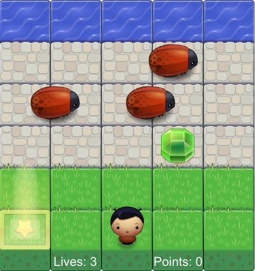
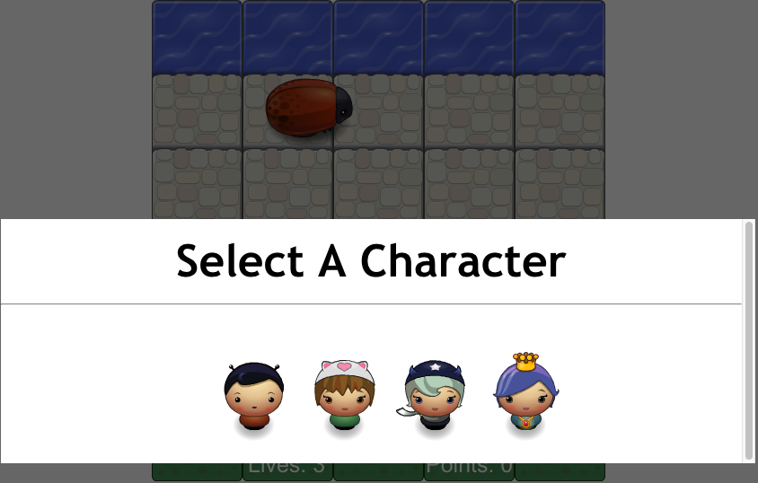

# Arcade Crossy Road

## Goals
1. You must get your character safely to the water.
2. Collect as many gems as you can before reaching the water.
3. **Avoid the bugs as they run across the lane!**

## How to play
To move your character use
* Left-Arrow: Character moves left one tile
* Right-Arrow: Character moves right one tile
* Up-Arrow: Character moves up one tile
* Down-Arrow: Character moves down one tile

## How to change character
Move character to the yellow glowing start tile. When your character is on the star tile a character selection screen will appear.
**Left click on the character you would like to be!**

## Points and Lives**
Be brave a use your character to collect as many items you can along the lanes while avoid the enemy bugs.
You will receive different rewards depending on the items you collect.

|              Item                       |          Reward           |
|:---------------------------------------:|:-------------------------:|
|  | **5 points (Common)** |
|  | **10 points (Moderate)** |
|  | **20 points (Rare)** |
|  | **Extra Life (Rare)** |

## Losing
Each time you run into a bug you will lose **1** life. Once you lose all your lives you can start can restart the game by selecting the **Replay** button that will appear.

## Important
**Remember collect as many items as you can before running to the water.**

**Good Luck!**
